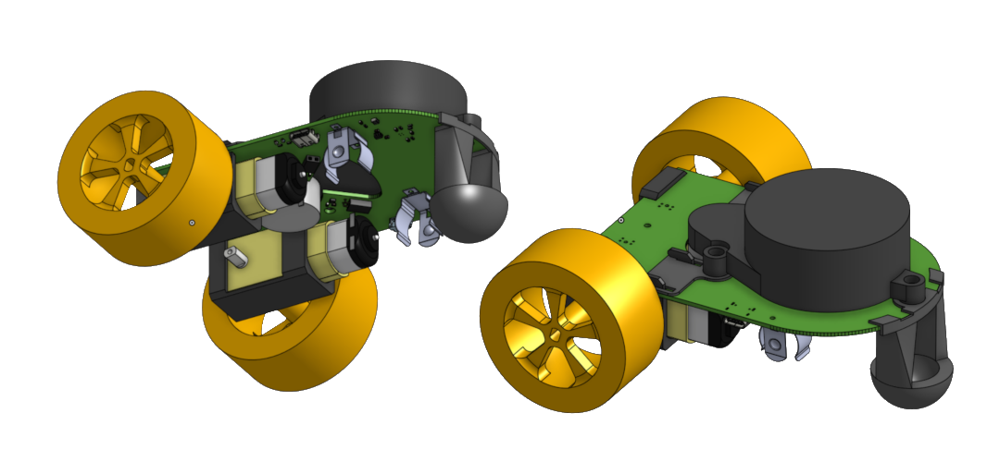

# HARDWARE

  

Little red rover was designed using OnShape and KiCAD (
[OnShape project](https://cad.onshape.com/documents/3c9bcb798eb55dc89c3300c0/w/50990f614f9cfbc3dc016690/e/81981a5257c68cf876fffafa?renderMode=0&uiState=662964f9611b155af71d904d), [KiCAD project](https://github.com/usedhondacivic/little_red_rover/tree/main/HARDWARE/little_red_rover)
).

It is composed of:

* one PCB body
* five 3D printed components (one front skid, two motor mounts, two shims)
* two [TT motors](https://www.adafruit.com/product/3777?gad_source=1&gclid=CjwKCAjw26KxBhBDEiwAu6KXt5uG3_2NXlyCQ1a62bnWJBUqD17JV0xqHqTxL5mOxYhjMxGvXihpPxoCFa0QAvD_BwE)
* two [wheels](https://www.adafruit.com/product/3766?gad_source=1&gclid=CjwKCAjw26KxBhBDEiwAu6KXt0UVN-z849ObhwJ45LRUqls9ojR2lNufE6720qHnvX_B1n_j5iZLehoCHT0QAvD_BwE)
* one [LD20 LiDAR](https://www.youyeetoo.com/products/youyeetoo-fhl-ld20)
* three M3 screws

and thats it!

