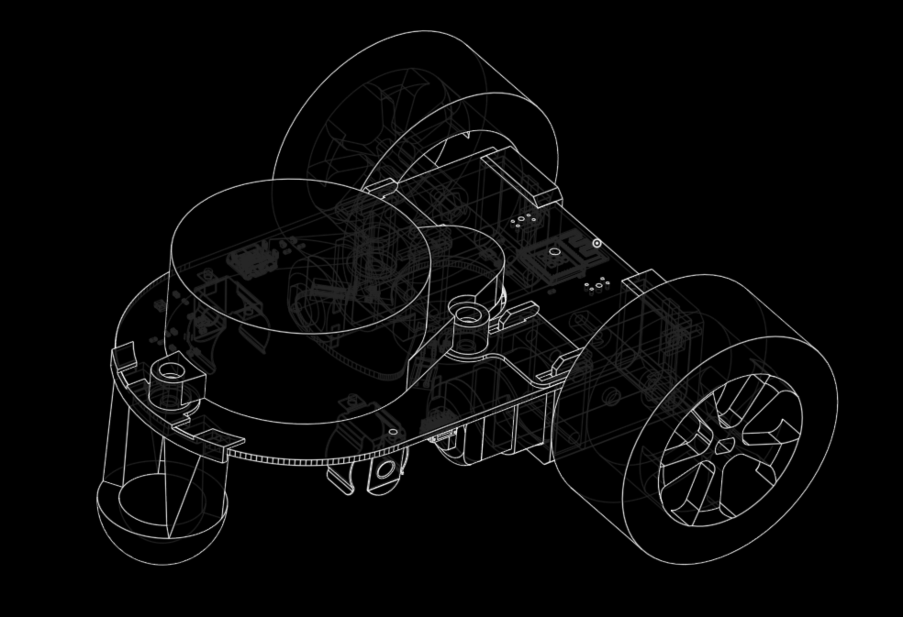

# Little Red Docs

ROS enabled robots are (really) expensive, preventing many aspiring robotic engineers using powerful ROS tools.

Little Red Rover (LRR) is a highly capable, differential drive, ROS 2 robot designed for an amateur budget.
While none of the rovers' specs are top of the line, LRR gives students, hobbyists, and educators a representative ROS 2 experience and an entry point into the wonderful world of research robotics.
Extensive development tooling, example code / projects, and documentation is provided to smooth the learning curve.

## Thanks <!-- {docsify-ignore} -->

LRR is part of my Masters of Engineering (MEng) thesis for Cornell University.

Special thanks to my advisor, [Professor Tapomayukh Bhattacharjee](https://robotics.cornell.edu/faculty/tapomayukh-bhattacharjee-bio/) of the [EmPRISE Lab](https://emprise.cs.cornell.edu/). LRR was inspired by his course, Foundations of Robotics, and his help on the project has been invaluable.
